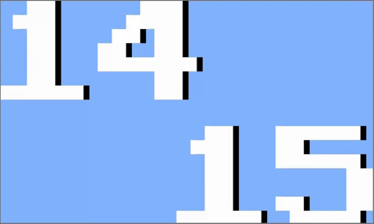

# Flutter Clock

## Welcome to Flutter Clock!

<ul>
<li>Visit <a href="https://flutter.dev/clock"><b>flutter.dev/clock</b></a> for how to get started, submission requirements, contest rules, and FAQs.

<li>See <a href="https://maryx.github.io/flutter_clock"><b>live demo</b></a> with Flutter for Web!
</ul>

## Examples
<ul>
<li><a href="https://github.com/flutter/flutter_clock/blob/master/analog_clock"><b>Analog Clock</b></a></li>

  

<li><a href="https://github.com/flutter/flutter_clock/blob/master/digital_clock"><b>Digital Clock</b></a></li>

</ul>

 

<a href="https://twitter.com/intent/tweet?hashtags=FlutterClock&amp;url=https://flutter.dev/clock"><b>Share #FlutterClock with friends</b>
