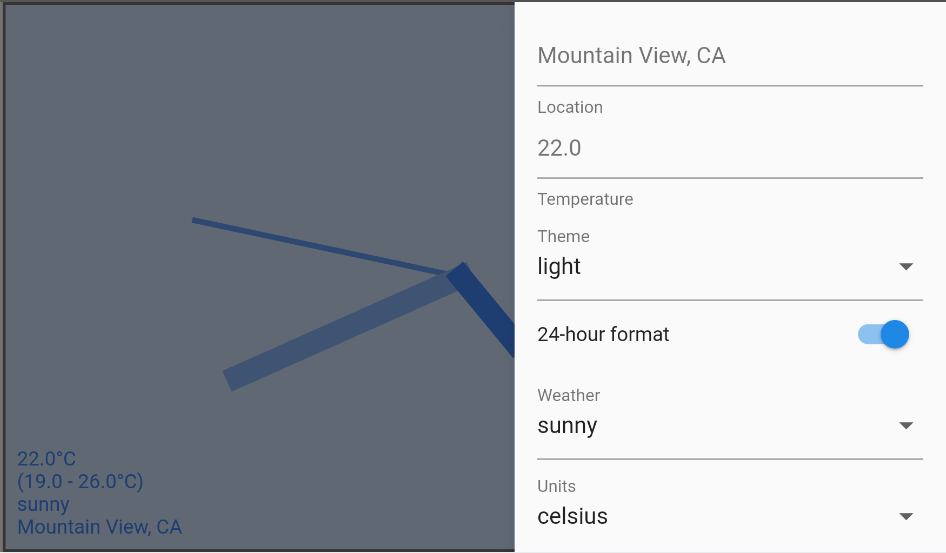

# Flutter Clock Helper

This package provides scaffolding code for the clock in the Flutter Clock contest.

Contestants: Do not edit this code.


## Model
Provides data that can change in the clock. Look in model.dart for more details.

 * Time format (12- or 24-hour)
 * Location
 * Temperature
 * Temperature high
 * Temperature low
 * Temperature unit
 * Weather unit


## Clock Customizer
Provides customizations for your clock (based on the model).
You can change the behavior of your clock based on these customizations.



To use inside your app's `main.dart`:

```
  runApp(ClockCustomizer((ClockModel model) => AnalogClock(model)));
```

For more information, see the code inside [lib/](lib).
For a full example, see the [Analog Clock](../analog_clock) or [Digital Clock](../digital_clock) in this GitHub repo.
